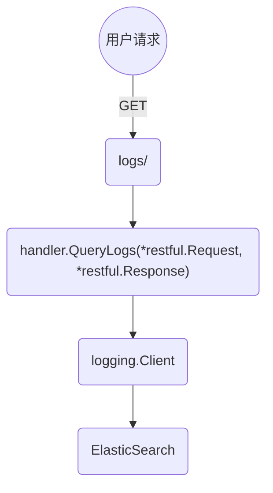

# ks 日志功能的实现

## 一，总体响应流程

从如何响应用户在页面上发起的读取日志的请求看，ks 的日志模块的大致结构如下：



- 当用户从页面向获取日志的 API 发起请求时，工作空间 tenant 的 [QueryLogs 方法](../pkg/kapis/tenant/v1alpha2/handler.go)将处理这个请求，并返回以下的数据结构作为响应：

    ```go
    type APIResponse struct {
    	Logs       *logging.Logs       `json:"query,omitempty" description:"query results"`
    	Statistics *logging.Statistics `json:"statistics,omitempty" description:"statistics results"`
    	Histogram  *logging.Histogram  `json:"histogram,omitempty" description:"histogram results"`
    }
    ```

- 在 QueryLogs 方法的实现中，根据请求传入的日志查询参数，调用了 handler 中 tenant 字段的 [QuearyLogs 方法](../pkg/models/tenant/tenant.go)，生成返回结果：

    ```go
    type tenantHandler struct {
    	tenant          tenant.Interface
    	meteringOptions *meteringclient.Options
    }


    func (t *tenantOperator) QueryLogs(user user.Info, query *loggingv1alpha2.Query) (*loggingv1alpha2.APIResponse, error) 
    ```

- 上面代码中的 tenantOperator 结构中有个 logging.LoggingOperator 接口类型的字段，QueryLogs 方法中的业务逻辑代码就是与接口实现的 4 个方法互动，产生返回结果：

    ```go
    type LoggingOperator interface {
    	GetCurrentStats(sf logging.SearchFilter) (v1alpha2.APIResponse, error)
    	CountLogsByInterval(sf logging.SearchFilter, interval string) (v1alpha2.APIResponse, error)
    	ExportLogs(sf logging.SearchFilter, w io.Writer) error
    	SearchLogs(sf logging.SearchFilter, from, size int64, order string) (v1alpha2.APIResponse, error)
    }
    ```

- 函数 func NewLoggingOperator(client logging.Client) LoggingOperator 接收的 logging.Client 参数在[这里](../cmd/ks-apiserver/app/options/options.go)被初始化。可以看出其就是一个 ElasticSearch 的客户端封装:

    ```go
    if s.LoggingOptions.Host != "" {
    	loggingClient, err := esclient.NewClient(s.LoggingOptions)
    	if err != nil {
    		return nil, fmt.Errorf("failed to connect to elasticsearch, please check elasticsearch status, error: %v", err)
    	}
    	apiServer.LoggingClient = loggingClient
    }
    ```

- 最终那 4 个接口方法的调用都通过 es 的客户端作用在 es 数据库上，返回结果层层上传最终到达 API 客户端

## 二，模块初始化流程

在上面的流程梳理中，从下到上涉及到的组件，以及初始化它们的代码:

- ApiServer 结构中 LoggingClient 字段指向的 [es 客户端](../cmd/ks-apiserver/app/options/options.go)

    ```go
    if s.LoggingOptions.Host != "" {
    	loggingClient, err := esclient.NewClient(s.LoggingOptions)
    	if err != nil {
    		return nil, fmt.Errorf("failed to connect to elasticsearch, please check elasticsearch status, error: %v", err)
    	}
    	apiServer.LoggingClient = loggingClient
    }
    ```

- 在[这篇分析](./api-server-restful-container.md)中提到的为所有 API 注册 Path 和 Hanlder 的代码中，注册包含 /logs 的 tenant 服务的代码如下。其中传入了上方代码中初始化的 s.LoggingClient：

    ```go
    urlruntime.Must(tenantv1alpha2.AddToContainer(s.container, s.InformerFactory, s.KubernetesClient.Kubernetes(),
    	s.KubernetesClient.KubeSphere(), s.EventsClient, s.LoggingClient, s.AuditingClient, amOperator, imOperator, rbacAuthorizer, s.MonitoringClient, s.RuntimeCache, s.Config.MeteringOptions, s.OpenpitrixClient))
    ```

- 在 tenantv1alpha2.AddToContainer() 方法的实现中，首先将 LoggingClient 传给生成 handler 的工厂函数，以便实现 QueryLogs 方法：

    ```go
    handler := NewTenantHandler(factory, k8sclient, ksclient, evtsClient, loggingClient, auditingclient, am, im, authorizer, monitoringclient, resourcev1alpha3.NewResourceGetter(factory, cache), meteringOptions, opClient)
    ```

- 然后为 /logs 路径绑定 handler 并声明参数列表：

    ```go
	ws.Route(ws.GET("/logs").
		To(handler.QueryLogs).
		Doc("Query logs against the cluster.").
        //参数列表过长，在下一节展示
		Metadata(restfulspec.KeyOpenAPITags, []string{constants.LogQueryTag}).
		Writes(loggingv1alpha2.APIResponse{}).
		Returns(http.StatusOK, api.StatusOK, loggingv1alpha2.APIResponse{})).
		Consumes(restful.MIME_JSON, restful.MIME_XML).
		Produces(restful.MIME_JSON, "text/plain")
    ```

## 三，handler.QueryLogs() 的实现

handler.QueryLogs() 的参数列表，以及每个参数的含义，例子见下方代码。也可以从中得到参数模块通过前端透出的功能：

```go
Param(ws.QueryParameter("operation", "Operation type. This can be one of four types: query (for querying logs), statistics (for retrieving statistical data), histogram (for displaying log count by time interval) and export (for exporting logs). Defaults to query.").DefaultValue("query").DataType("string").Required(false)).
Param(ws.QueryParameter("namespaces", "A comma-separated list of namespaces. This field restricts the query to specified namespaces. For example, the following filter matches the namespace my-ns and demo-ns: `my-ns,demo-ns`").DataType("string").Required(false)).
Param(ws.QueryParameter("namespace_query", "A comma-separated list of keywords. Differing from **namespaces**, this field performs fuzzy matching on namespaces. For example, the following value limits the query to namespaces whose name contains the word my(My,MY,...) *OR* demo(Demo,DemO,...): `my,demo`.").DataType("string").Required(false)).
Param(ws.QueryParameter("workloads", "A comma-separated list of workloads. This field restricts the query to specified workloads. For example, the following filter matches the workload my-wl and demo-wl: `my-wl,demo-wl`").DataType("string").Required(false)).
Param(ws.QueryParameter("workload_query", "A comma-separated list of keywords. Differing from **workloads**, this field performs fuzzy matching on workloads. For example, the following value limits the query to workloads whose name contains the word my(My,MY,...) *OR* demo(Demo,DemO,...): `my,demo`.").DataType("string").Required(false)).
Param(ws.QueryParameter("pods", "A comma-separated list of pods. This field restricts the query to specified pods. For example, the following filter matches the pod my-po and demo-po: `my-po,demo-po`").DataType("string").Required(false)).
Param(ws.QueryParameter("pod_query", "A comma-separated list of keywords. Differing from **pods**, this field performs fuzzy matching on pods. For example, the following value limits the query to pods whose name contains the word my(My,MY,...) *OR* demo(Demo,DemO,...): `my,demo`.").DataType("string").Required(false)).
Param(ws.QueryParameter("containers", "A comma-separated list of containers. This field restricts the query to specified containers. For example, the following filter matches the container my-cont and demo-cont: `my-cont,demo-cont`").DataType("string").Required(false)).
Param(ws.QueryParameter("container_query", "A comma-separated list of keywords. Differing from **containers**, this field performs fuzzy matching on containers. For example, the following value limits the query to containers whose name contains the word my(My,MY,...) *OR* demo(Demo,DemO,...): `my,demo`.").DataType("string").Required(false)).
Param(ws.QueryParameter("log_query", "A comma-separated list of keywords. The query returns logs which contain at least one keyword. Case-insensitive matching. For example, if the field is set to `err,INFO`, the query returns any log containing err(ERR,Err,...) *OR* INFO(info,InFo,...).").DataType("string").Required(false)).
Param(ws.QueryParameter("interval", "Time interval. It requires **operation** is set to histogram. The format is [0-9]+[smhdwMqy]. Defaults to 15m (i.e. 15 min).").DefaultValue("15m").DataType("string").Required(false)).
Param(ws.QueryParameter("start_time", "Start time of query. Default to 0. The format is a string representing seconds since the epoch, eg. 1559664000.").DataType("string").Required(false)).
Param(ws.QueryParameter("end_time", "End time of query. Default to now. The format is a string representing seconds since the epoch, eg. 1559664000.").DataType("string").Required(false)).
Param(ws.QueryParameter("sort", "Sort order. One of asc, desc. This field sorts logs by timestamp.").DataType("string").DefaultValue("desc").Required(false)).
Param(ws.QueryParameter("from", "The offset from the result set. This field returns query results from the specified offset. It requires **operation** is set to query. Defaults to 0 (i.e. from the beginning of the result set).").DataType("integer").DefaultValue("0").Required(false)).
Param(ws.QueryParameter("size", "Size of result to return. It requires **operation** is set to query. Defaults to 10 (i.e. 10 log records).").DataType("integer").DefaultValue("10").Required(false)).
```	

```go
func (h *tenantHandler) QueryLogs(req *restful.Request, resp *restful.Response) {
	user, ok := request.UserFrom(req.Request.Context())
	if !ok {
		err := fmt.Errorf("cannot obtain user info")
		klog.Errorln(err)
		api.HandleForbidden(resp, req, err)
		return
	}
	queryParam, err := loggingv1alpha2.ParseQueryParameter(req)
	if err != nil {
		klog.Errorln(err)
		api.HandleInternalError(resp, req, err)
		return
	}

	if queryParam.Operation == loggingv1alpha2.OperationExport {
		resp.Header().Set(restful.HEADER_ContentType, "text/plain")
		resp.Header().Set("Content-Disposition", "attachment")
		err := h.tenant.ExportLogs(user, queryParam, resp)
		if err != nil {
			klog.Errorln(err)
			api.HandleInternalError(resp, req, err)
			return
		}
	} else {
		result, err := h.tenant.QueryLogs(user, queryParam)
		if err != nil {
			klog.Errorln(err)
			api.HandleInternalError(resp, req, err)
			return
		}
		resp.WriteAsJson(result)
	}
}
```

上面的代码中主要有以下几个要点：

- 从 req 的上下文中，提取出 user 的信息。user 信息来自[验证模块](./api-server-authentication.md)

- 解析 URL 中的参数列表，并放入 queryParam 中

- 参数 Operation 支持四种操作：query：查询日志；export：导出日志；histogram：日志数量的直方图；statistics：日志的统计信息

- 根据 Operation 的具体值，决定是调用 ExportLogs 将日志流写到 resp 中，还是调用 QueryLogs 来处理其他三种情况

- 最终 4 种操作对于 es 客户端的具体调用，都回到了这 4 个接口方法上：

    ```go
    type Client interface {
    	GetCurrentStats(sf SearchFilter) (Statistics, error)
    	CountLogsByInterval(sf SearchFilter, interval string) (Histogram, error)
    	SearchLogs(sf SearchFilter, from, size int64, order string) (Logs, error)
    	ExportLogs(sf SearchFilter, w io.Writer) error
    }
    ```

## 四，总结

- ks 对于 es 客户端的行为，根据前端的功能需求，做了最小化的抽象。可以扩展上面的 interface，为 es 客户端增加新的功能，例如备份

- 通过增加 /logs 接受的参数，增加 API 的功能

- ks 的 API 分版本，可以为 /logs 新起版本，来隔离原版功能和新增加的功能

- 从 handler 到最终 es Client，封装过几层  interface。需考虑增加新功能的同时，如何对原有代码的最小侵入。
