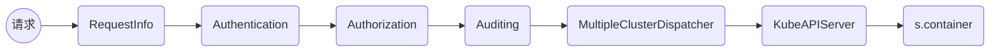

# kubesphere API Server Handler 链的配置

## Handler 链

在 PrepareRun() 方法中，首先将各种 API 的路径和 handler 绑定到了 restful container 中，container 由于实现了 ServeHTTP 方法，所以可以作为 http Hanlder 被使用。

```go
func (s *APIServer) PrepareRun(stopCh <-chan struct{}) error {

    // 一些初始化工作...

	s.installKubeSphereAPIs(stopCh)
	s.installCRDAPIs()
	s.installMetricsAPI()
	s.container.Filter(monitorRequest)

    // 将 container 作为最后一层处理 API 业务逻辑的 handler
	s.Server.Handler = s.container

    // 在之前加入其他的预处理 handler
	s.buildHandlerChain(stopCh)

	return nil
}
```
但是在用户的 API 请求真正到达处理业务的 container 之前，api server 还需要做一些诸如请求的额外信息的提取，验证/鉴权，k8s/ks 请求分类，其他集群的代理转发等预处理操作。这些操作都有各自的 handler 实现，并且从前到后串联在一起，最后才到达 container。这也是上面代码中最后 s.buildHandlerChain() 做的事情。下图展示了 handler 链最终配置完成后的顺序：



而在代码中，这些 handler 则是以相反的顺序进行串联操作的，最后被加入的 handler 最先处理请求：

```go
func (s *APIServer) buildHandlerChain(stopCh <-chan struct{}) {
	handler := s.Server.Handler
	handler = filters.WithKubeAPIServer(handler, s.KubernetesClient.Config(), &errorResponder{})

	if s.Config.AuditingOptions.Enable {
		handler = filters.WithAuditing(handler,
			audit.NewAuditing(s.InformerFactory, s.Config.AuditingOptions, stopCh))
	}

	handler = filters.WithAuthorization(handler, authorizers)
	if s.Config.MultiClusterOptions.Enable {
		handler = filters.WithMultipleClusterDispatcher(handler, clusterDispatcher)
	}

	handler = filters.WithAuthentication(handler, authn)
	handler = filters.WithRequestInfo(handler, requestInfoResolver)

	s.Server.Handler = handler
}
```

这些 handler 串联函数都实现在 [pkg/apiserver/filters](../pkg/apiserver/filters/) 包中，都使用了修饰器的方法，在返回的 handler 中先执行自己的代码，然后再调用传入的 handler 继续处理请求。

## WithRequestInfo

值得一提的是第一个 handler RequestInfo:

```go
func WithRequestInfo(handler http.Handler, resolver request.RequestInfoResolver) http.Handler {
    // 省略若干代码 ...
	return http.HandlerFunc(func(w http.ResponseWriter, req *http.Request) {
		ctx := req.Context()
		info, err := resolver.NewRequestInfo(req)
		if err != nil {
			responsewriters.InternalError(w, req, fmt.Errorf("failed to crate RequestInfo: %v", err))
			return
		}

		req = req.WithContext(request.WithRequestInfo(ctx, info))
		handler.ServeHTTP(w, req)
	})
}
```

在 RequestInfo handler 中，提取出一些有帮助的信息，然后放入请求 req 的上下文 (context) 中：

```go
type RequestInfo struct {
	*k8srequest.RequestInfo

	// IsKubernetesRequest indicates whether or not the request should be handled by kubernetes or kubesphere
	IsKubernetesRequest bool

	// Workspace of requested resource, for non-workspaced resources, this may be empty
	Workspace string

	// Cluster of requested resource, this is empty in single-cluster environment
	Cluster string

	// DevOps project of requested resource
	DevOps string

	// Scope of requested resource.
	ResourceScope string

	// Source IP
	SourceIP string

	// User agent
	UserAgent string
}

type RequestInfo struct {
	// IsResourceRequest indicates whether or not the request is for an API resource or subresource
	IsResourceRequest bool
	// Path is the URL path of the request
	Path string
	// Verb is the kube verb associated with the request for API requests, not the http verb.  This includes things like list and watch.
	// for non-resource requests, this is the lowercase http verb
	Verb string

	APIPrefix  string
	APIGroup   string
	APIVersion string
	Namespace  string
	// Resource is the name of the resource being requested.  This is not the kind.  For example: pods
	Resource string
	// Subresource is the name of the subresource being requested.  This is a different resource, scoped to the parent resource, but it may have a different kind.
	// For instance, /pods has the resource "pods" and the kind "Pod", while /pods/foo/status has the resource "pods", the sub resource "status", and the kind "Pod"
	// (because status operates on pods). The binding resource for a pod though may be /pods/foo/binding, which has resource "pods", subresource "binding", and kind "Binding".
	Subresource string
	// Name is empty for some verbs, but if the request directly indicates a name (not in body content) then this field is filled in.
	Name string
	// Parts are the path parts for the request, always starting with /{resource}/{name}
	Parts []string
}
```

在其后面的 handler 中，都可以方便的将常用信息取出，不需要每次都自行提取：

```go
ctx := req.Context()
requestInfo, found := request.RequestInfoFrom(ctx)
```
