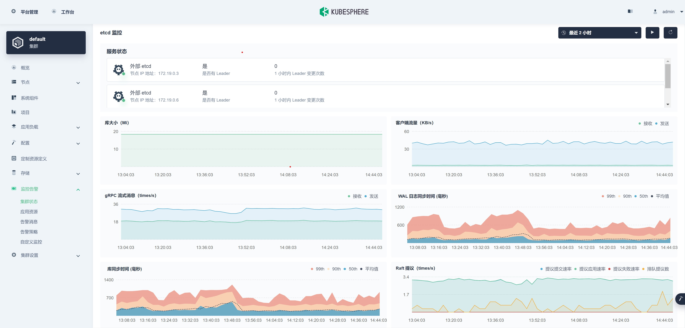

# 其他功能问题

## 一，打开 Etcd 监控以及解决界面没有数据问题

### 1，打开 Etcd 的性能指标监控功能

编辑集群的配置类型 clusterconfigurations 资源：

```sh
$ kubectl -n kubesphere-system edit cc ks-installer
```

修改 etcd 一节为下方内容：

```yaml
  etcd:
    endpointIps: 172.19.0.3,172.19.0.6,172.19.0.7    #此处应为 Etcd 集群所有节点的 IP
    monitoring: true
    port: 2379
    tlsEnable: true
```

### 2，为 Prometheus 挂载 Etcd 的客户端证书

将 Etcd 的 CA，Cert 和 Key 保存为 Secret。以 kind 集为例：

```sh
#!/bin/bash

docker cp kind-control-plane:/etc/kubernetes/pki/etcd/ca.crt ./ca.crt
docker cp kind-control-plane:/etc/kubernetes/pki/etcd/healthcheck-client.crt ./healthcheck-client.crt
docker cp kind-control-plane:/etc/kubernetes/pki/etcd/healthcheck-client.key ./healthcheck-client.key

kubectl -n kubesphere-monitoring-system create secret generic kube-etcd-client-certs \
--from-file=etcd-client-ca.crt=./ca.crt \
--from-file=etcd-client.crt=./healthcheck-client.crt \
--from-file=etcd-client.key=./healthcheck-client.key

rm ./ca.crt ./healthcheck-client.crt ./healthcheck-client.key
```

编辑 Prometheuses 的监控配置：

```sh
$ kubectl -n kubesphere-monitoring-system  edit prometheuses.monitoring.coreos.com k8s
```

加入下方的片段内容，将刚才创建的 secret 放到 secrets 的列表中：

```yaml
  scrapeInterval: 1m
  secrets:
  - kube-etcd-client-certs
  securityContext:
    fsGroup: 0
```

保存后重启 Prometheus:

```sh
kubectl -n kubesphere-monitoring-system rollout restart statefulset/prometheus-k8s
```

最后效果如下图：



## 二，Scheduler 监控界面没有数据

修改每个控制节点上 scheduler 的静态 Pod 文件 /etc/kubernetes/manifests/kube-scheduler.yaml。将 kube-schedualer 的启动参数 --bind-address 改为 0.0.0.0。

在 KinD 集群中，可以用下方脚本批量修改：

```sh
#!/bin/bash

for n in $(kubectl get node -l node-role.kubernetes.io/control-plane= -o custom-columns=":metadata.name")
do
    echo $n
    docker exec -i ${n} bash -c "sed -i 's/--bind-address=127.0.0.1/--bind-address=0.0.0.0/g' /etc/kubernetes/manifests/kube-scheduler.yaml"
done
```
